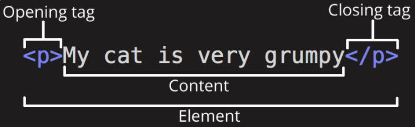
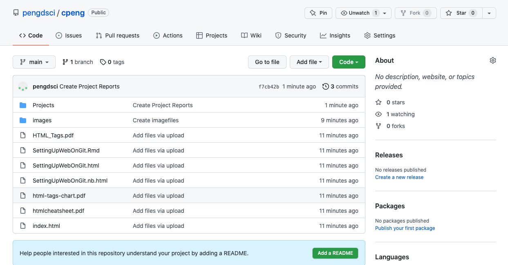
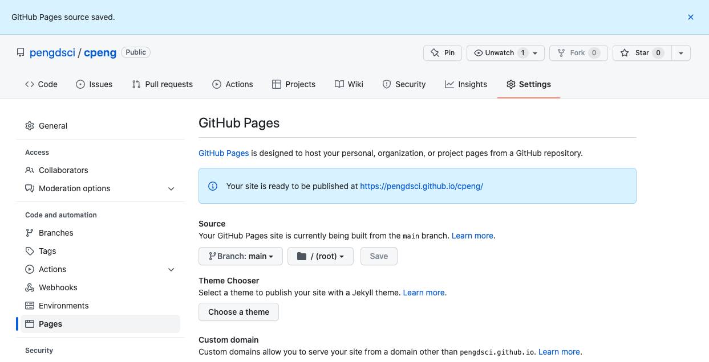

<style type="text/css">

div#TOC li {
    list-style:none;
    background-image:none;
    background-repeat:none;
    background-position:0;
}
h1.title {
  font-size: 24px;
  color: DarkRed;
  text-align: center;
}
h4.author { /* Header 4 - and the author and data headers use this too  */
    font-size: 18px;
  font-family: "Times New Roman", Times, serif;
  color: DarkRed;
  text-align: center;
}
h4.date { /* Header 4 - and the author and data headers use this too  */
  font-size: 18px;
  font-family: "Times New Roman", Times, serif;
  color: DarkBlue;
  text-align: center;
}
h1 { /* Header 3 - and the author and data headers use this too  */
    font-size: 22px;
    font-family: "Times New Roman", Times, serif;
    color: darkred;
    text-align: center;
}
h2 { /* Header 3 - and the author and data headers use this too  */
    font-size: 18px;
    font-family: "Times New Roman", Times, serif;
    color: navy;
    text-align: left;
}

h3 { /* Header 3 - and the author and data headers use this too  */
    font-size: 15px;
    font-family: "Times New Roman", Times, serif;
    color: navy;
    text-align: left;
}

h4 { /* Header 4 - and the author and data headers use this too  */
    font-size: 18px;
    font-family: "Times New Roman", Times, serif;
    color: darkred;
    text-align: left;
}
</style>

```{r setup, include=FALSE}
# code chunk specifies whether the R code, warnings, and output 
# will be included in the output files.
if (!require("tidyverse")) {
   install.packages("tidyverse")
   library(tidyverse)
}
if (!require("knitr")) {
   install.packages("knitr")
   library(knitr)
}
if (!require("cowplot")) {
   install.packages("cowplot")
   library(cowplot)
}
if (!require("latex2exp")) {
   install.packages("latex2exp")
   library(latex2exp)
}
if (!require("plotly")) {
   install.packages("plotly")
   library(plotly)
}
if (!require("gapminder")) {
   install.packages("gapminder")
   library(gapminder)
}
if (!require("png")) {
    install.packages("png")             # Install png package
    library("png")
}
if (!require("RCurl")) {
    install.packages("RCurl")             # Install RCurl package
    library("RCurl")
}
if (!require("colourpicker")) {
    install.packages("colourpicker")              
    library("colourpicker")
}
if (!require("gganimate")) {
    install.packages("gganimate")              
    library("gganimate")
}
if (!require("gifski")) {
    install.packages("gifski")              
    library("gifski")
}
if (!require("magick")) {
    install.packages("magick")              
    library("magick")
}
if (!require("grDevices")) {
    install.packages("grDevices")              
    library("grDevices")
}
if (!require("pracma")) {
    install.packages("pracma")              
    library("pracma")
}
# knitr::opts_knit$set(root.dir = "C:/Users/75CPENG/OneDrive - West Chester University of PA/Documents")
# knitr::opts_knit$set(root.dir = "C:\\STA490\\w05")

knitr::opts_chunk$set(echo = TRUE,       
                      warning = FALSE,   
                      result = TRUE,   
                      message = FALSE)
```

# Introduction

In this short note, we introduce how to set up a static personal web site on the Github repository so you can use this platform to post your professional information and showcase your talent.


# Basics of HTML

HTML is a `markup language` that defines the structure of the content. HTML consists of a series of **elements**, which we can use to enclose, or wrap, different parts of the content to display it in certain ways. The enclosing tags can be used to organize the contents, embed images, create tables, and manipulate fonts (such as the size, colors, family, face, alignment, etc). 

The components of an element are as follows:

* **The opening tag**: This consists of the name of the element (in this case, p), wrapped in opening and closing angle brackets. This states where the element begins or starts to take effect — in this case where the paragraph begins.

* **The closing tag**: This is the same as the opening tag, except that it includes a forward slash before the element name. This states where the element ends — in this case where the paragraph ends. Failing to add a closing tag is one of the standard beginner errors and can lead to strange results.

* **The content**: This is the content of the element, which in this case, is just text.

* **The element**: The opening tag, the closing tag, and the content together comprise the element.

<center> </center>

## Basic HTML Tags

HTML is a fairly straightforward programming language. There is a range of HTML tags that help us to design our web page. Four of the tags are required in HTML: html, title, head and body. 

The anatomy of HTML tag has been illustrated earlier. A list of important tags can be found at <a href = "html-tags-chart.pdf">html-tags-chart.pdf </a>.


## Anatomy of An HTML Document

That wraps up the basics of individual HTML elements, but they aren't handy on their own. Now we'll look at how individual elements are combined to form an entire HTML page. Let's revisit the code we put into our index.html example (which we first met in the Dealing with files article):

```{}
<!DOCTYPE html>
<html>                                    <!-- open html tag: required  -->
  <head>                                  <!-- open page header: required -->
    <meta charset="utf-8">
    <title>My First Web Page</title>      <!-- page title appears on the tab -->
  </head>                                 <!-- close page header: required -->
  <body>       <!-- open html body: required -->
    <!-- All contents of the web page MUST be placed between <body> </body> -->
    <!-- The following img tag is an example. -->
     
  </body>                                <!-- close html body: required -->
</html>                                  <!-- close html tag: required -->
```

The above HTML code only illustrates the skeleton of a HTML document. A sample of a 

## Page Design Tips

HTML table is very useful to create a plain HTML page for beginners who don't use CSS and Bootstrap in their web design. The detailed HTML table attributes can be found at <a href = "https://www.htmlcenter.com/blog/html-table-attributes/">HTML Table Attributes</a>. 

You can see the example of web page page using HTML table to layout the simple web page.


# Host Your Personal Web Site on Github

Hosting on Github is relatively straightforward once you signed up an Github account. The configuration is simple.

## Create A Github Account

We have already introduced the steps to create a Github account.  

## Create A Web Page

To create a web page, you need to follow the next few steps

**Step 1**: Create a folder in your local computer and give a meaningful name. In my example, I used `WebOnGitRepos`. 

**Step 2**: Use a text editor to create an HTML file and save it in the folder created in **Step 1** using name `index.html`. Please note that this mandatory! 

**Step 3** All files (images and other HTML documents) MUST be saved in the same root directory and sub-directory (need to provide the path to the file in the `index.html`).


I use a free text editor called **Brackets** on my Mac computer and **Notepad++** on my Windows computer. You can also use R Studio to create an HTML document.


## Configure Web Foler on Github

Log in your Github account and do the following:

**Step 1**:  create a repository (folder) with a meaningful name (I used `cpeng`) to store the web page and related files.

**Step 2**: upload all files and folders from your local folder `WebOnGitRepos` that you created earlier to the repository you just created.  See the following screenshot.
<center>  </center>

\

**Step 3**: click `settings` --> click `pages` --> click `none` and select `main` and click `save`.

\

**Step 4**: The URL of the web site is <https://pengdsci.github.io/cpeng/>. See the following screenshot.
<center>  </center>

\

\


